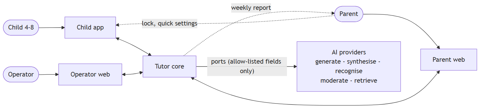
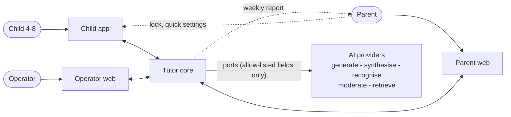
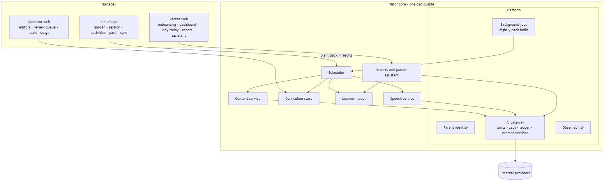
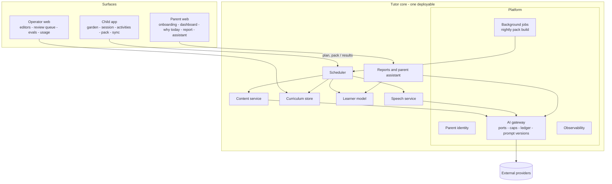
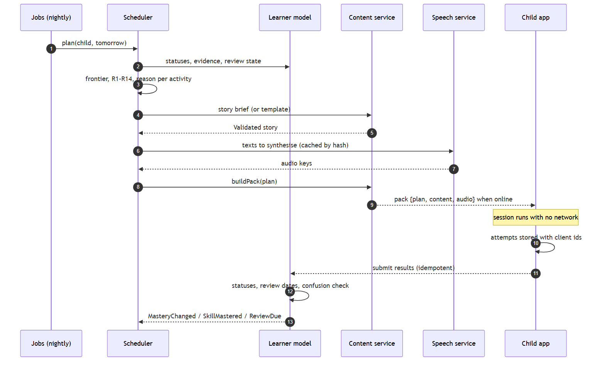
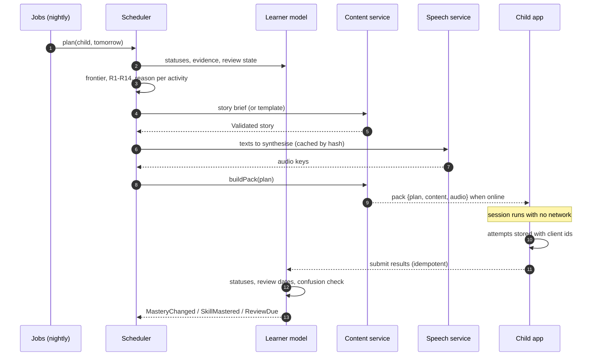
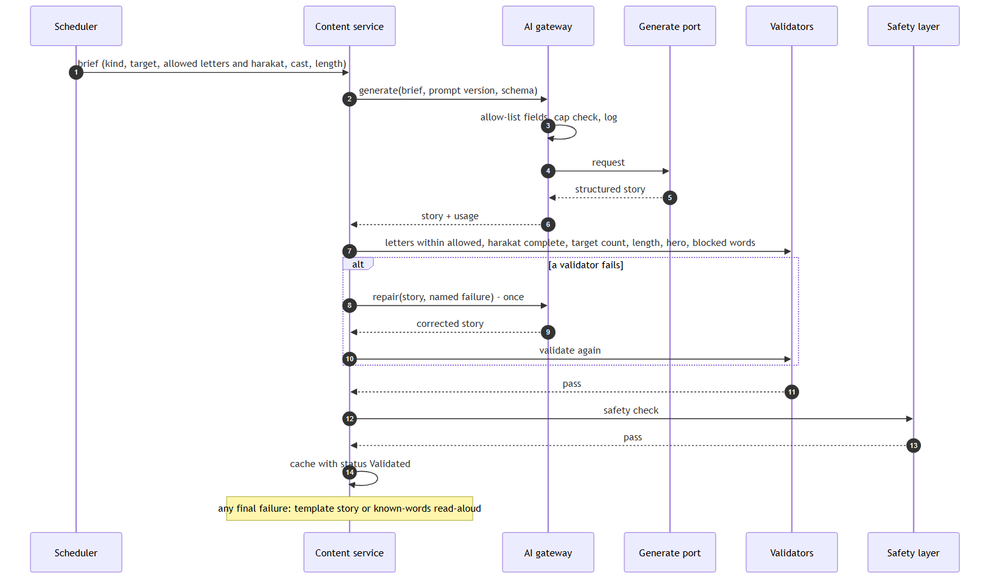
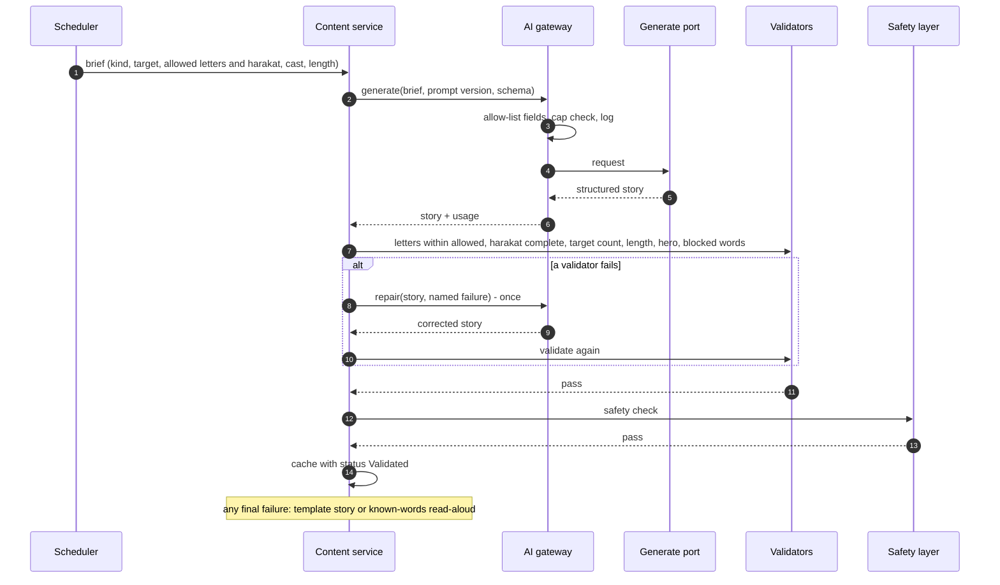
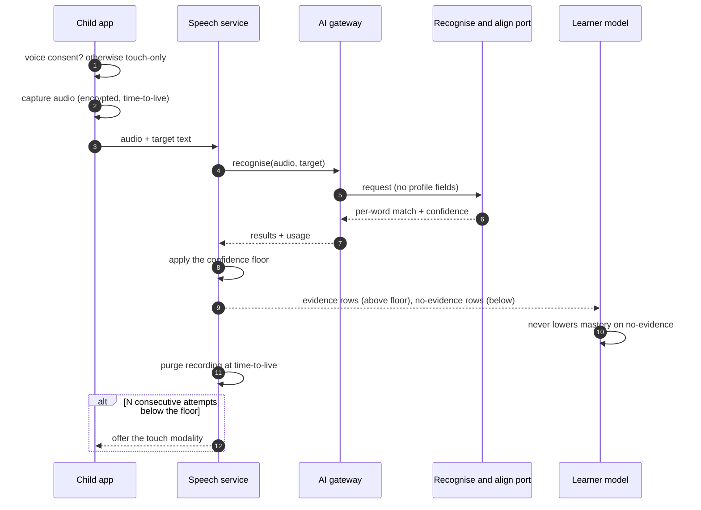

## Revision history {.unnumbered}

| Version | Date | Author | Change |
| --- | --- | --- | --- |
| 0.1 | 2026-09-21 | Abdulsalam | Capability architecture: context, capabilities, module rules, event map, three key flows, data ownership, cross-cutting concerns, decisions log. **No product named**; products arrive with the Phase 5 ADRs |

# Purpose and scope

This document describes Nabta as a set of **capabilities** joined by **contracts and events**,
so that the system can be reasoned about, tested and costed before a single technology is
chosen. It answers: what are the parts, what does each own, what may cross a boundary, and how
do the three flows that define the product actually run. It does *not* name a language, a
framework, a database or a provider. When Phase 5 ends, every open component in PLAN §8.1 has a
decision record, and this document's next major version becomes the *software* architecture:
the same boxes with products inside them and the decisions log filled.

Sources: the charter (`vision.md`), the pedagogy (`pedagogy.md`), the requirements (`srs.md`) —
flows below cite requirement IDs — and PLAN §6–§7.

::: {custom-style="RTL"}
**الملخص.** تصف هذه الوثيقة نبتة كمجموعة **قدرات** تربطها **عقود وأحداث**، لا كمجموعة تقنيات: ما
الأجزاء، ماذا يملك كلٌّ منها، ما الذي يجوز أن يعبر الحدود بينها، وكيف تجري التدفّقات الثلاثة التي
تعرّف المنتج — الجلسة اليومية، توليد القصة، تقييم القراءة الجهرية. لا تسمّي لغة ولا إطارًا ولا قاعدة
بيانات ولا مزوّدًا؛ المنتجات تأتي مع قرارات المرحلة الخامسة، وحينها تصير هذه الوثيقة معمارية
البرمجيات بالصناديق نفسها والمنتجات داخلها.
:::

# Context

Three kinds of people, one system, and external AI providers that the system reaches only
through ports it owns.

| Element | Role | Notes |
| --- | --- | --- |
| Child | Learns; touch and voice only | Never an account; never sends free text anywhere (FR-AI-008) |
| Parent | Consents, configures, reads, asks | The account; the lock and quick settings inside the child app, everything else on the parent web (D-2026-09-21-8, proposed) |
| Operator | Curates, reviews, watches | One person |
| Child app | Runs a full session offline from a pack | Stores attempts with client ids until acknowledged (FR-TUT-005/006) |
| Parent web · Operator web | Read and administer | Network required |
| Tutor core | Everything else: one deployable with background jobs | P-1 |
| AI providers | Generation, synthesis, recognition, moderation, retrieval | Configuration behind ports; only allow-listed fields cross (FR-AI-001/004) |

# Capabilities

The container view, drawn as capabilities. Each box in the core is a **module** with its own
storage and a contract; the arrows are the only permitted dependencies.

| Capability | Owns | Offers (contract) | Emits |
| --- | --- | --- | --- |
| **Curriculum store** | skill graph (versioned), content items, word lists, activity templates, template stories, `policy` | load and validate a graph; expand nodes; `frontier(statuses)`; content by scope; decompose(text) | `CurriculumPublished` |
| **Learner model** | children (profile, consents), `SkillMastery`, `Attempt`, review state | record attempts (idempotent on client id); update statuses by the mastery rule; statuses and evidence for a child; export; delete | `AttemptRecorded`, `MasteryChanged`, `SkillMastered`, `ReviewDue`, `ConfusionDetected`, `ConsentChanged`, `ChildDeleted` |
| **Scheduler** | session plans and their reasons | `plan(child, date)` → plan with reasons (R1–R14, deterministic) | `SessionPlanned` |
| **Content service** | generated content and its statuses, review items, activity packs | `story(brief)`, `wordProblem(brief)` → Validated content or fallback; `buildPack(plan)`; review queue | `ContentValidated`, `ContentRejected`, `ContentFlagged`, `PackBuilt` |
| **Speech service** | audio assets (by text hash and voice), recordings (encrypted, TTL), alignment results | `synthesise(text, voice)` cached; `score(audio, target)` → per-word evidence; purge | `AudioSynthesised`, `RecordingScored`, `RecordingPurged` |
| **Reports & parent assistant** | weekly reports, `ParentQuery` log, retrieval index over pedagogy / guide / activities | dashboard data (from learner statuses), "why today" (from plan reasons), weekly report, `ask(question, child)` with sources | `WeeklyReportReady` |
| **Platform** | parent identity, storage, jobs, AI gateway (`Usage`, `Prompt`, `EvalRun`), observability | ports (generate, repair, synthesise, recognise & align, moderate, retrieve); caps; ledger; prompt versions; eval gate; schedules | `CapReached`, `ProviderFailed`, `EvalRun` |

# Module rules

These hold whatever the stack turns out to be (PLAN §6). They are the tests the software
architecture will be checked against.

1. **Explicit boundaries.** Curriculum, Learners, Tutor (scheduler), Content, Speech, Reports
   and the AI gateway are separate modules. A module reaches another only through its contract
   or by consuming its events; **no module reads another's storage**. A query that needs two
   modules' data is answered by one module calling the other's contract, or by a read model fed
   by events (the dashboard is one).
2. **AI behind interfaces.** Every model, synthesis, recognition, moderation and retrieval call
   goes through a port owned by the platform (FR-AI-001). Providers are configuration. Every
   call is logged and capped (FR-AI-002/003). The port enforces the field allow-list
   (FR-AI-004): nickname, age band, interests, cast first names and relations, non-personal
   constraints — nothing else, ever.
3. **Nothing unvalidated reaches a child.** Content is cached with a status; a pack contains
   only Validated or Approved content (FR-CNT-005, NFR-SAF-001); any rejection falls back to a
   template (FR-CNT-004).
4. **Children are not accounts.** A child is data owned by a parent account, selected by a PIN
   (FR-LRN-002). No credentials, no surname, no photo, no location — the fields do not exist.
5. **Offline is a feature.** The child app completes a session from a pack; submission is
   idempotent on client-generated ids (FR-TUT-005/006, NFR-OFF-*).
6. **Decisions produce reasons.** The scheduler emits a reason object with every planned
   activity at decision time (FR-TUT-003); no module reconstructs a reason afterwards.
7. **Evidence is typed.** An attempt is either evidence or no-evidence at the moment it is
   recorded (FR-LRN-005/006); nothing downstream reinterprets it.

# Event map

Events are facts, past tense, with a stable name and a small payload keyed by ids. They are
the only way a module learns about another's changes without calling it. *Planned:* delivery
semantics (in-process vs. queued) are a Phase 5 decision; the contract is at-least-once with
idempotent consumers.

| Event | Producer | Payload (key fields) | Consumers |
| --- | --- | --- | --- |
| `SessionPlanned` | Scheduler | child, date, plan id, activities with reasons | Content (build pack), Reports (why today) |
| `PackBuilt` | Content | child, date, pack id, size, content hashes | Child app sync, Observability |
| `AttemptRecorded` | Learner model | attempt id (client), child, skill(s), evidence flag, distractor | Learner model (mastery), Observability |
| `MasteryChanged` | Learner model | child, skill, old status, new status, estimate | Scheduler, Reports (dashboard read model), Child app (garden) |
| `SkillMastered` | Learner model | child, skill, mastered at | Scheduler (seed, letter-focus story), Reports |
| `ReviewDue` | Learner model | child, skill, due date | Scheduler |
| `ConfusionDetected` | Learner model | child, letter x, letter y, counts | Scheduler (R9), Reports (knot) |
| `ContentValidated` / `ContentRejected` / `ContentFlagged` | Content | content id, kind, brief hash, prompt version, validator report, cost | Content (pack), Operator review queue, Observability |
| `AudioSynthesised` | Speech | text hash, voice, duration, cost | Content (pack) |
| `RecordingScored` | Speech | attempt id, per-word results, floor applied | Learner model |
| `RecordingPurged` | Speech | recording id, purged at | Observability, privacy audit |
| `WeeklyReportReady` | Reports | child, week, report id | Parent notification |
| `ConsentChanged` | Learner model | child, scope, granted/revoked, at | Speech (disable capture), Content (template-only), audit |
| `CapReached` | AI gateway | scope (child/global), purpose, at | Content (fallback), Observability |
| `ProviderFailed` | AI gateway | port, error class, retries | Content (fallback), Observability |
| `ChildDeleted` | Learner model | child id, at | every module: purge; audit (without data) |

# Key flows

Each step cites the requirement it satisfies. Participants are capabilities, never products.

## Daily session

Nightly build, offline session, idempotent sync, next plan.

| # | Step | Requirements |
| --- | --- | --- |
| 1–3 | The nightly job asks the scheduler for tomorrow's plan; the scheduler reads the learner state, computes the frontier and applies R1–R14, attaching a reason to every activity | FR-CUR-004, FR-TUT-001…003, FR-CUR-010 |
| 4–5 | The story brief is written by the scheduler; the content service returns Validated content or a template story | FR-CNT-001…005, FR-CNT-007 |
| 6–7 | Every text in the plan is synthesised once and cached by hash | FR-SPC-001/002, NFR-COST-002 |
| 8–9 | The pack is assembled and pulled by the child app when a network exists | FR-TUT-005, NFR-OFF-001/002 |
| 10 | The session runs offline; attempts carry client-generated ids | NFR-OFF-001, FR-LRN-005 |
| 11–12 | Results are submitted at least once; the learner model applies the mastery rule and the confusion trigger; no-evidence rows never lower an estimate | FR-TUT-006, FR-LRN-006/007, FR-TUT-010, NFR-REL-001 |
| 13 | Events feed the next plan, the garden and the dashboard | FR-TUT-011, FR-RPT-001 |

**The staleness question.** The plan is built on the statuses of the night before; if the
warm-up changes them, a pre-generated story could fall outside the letter set (charter risk R3).
The architecture leaves three options for Phase 5 to cost: build one spare story below ability;
freeze the story's letter set to what was mastered before the warm-up (never the session's new
letter); or allow the story to be *below* ability, never above. All three keep G2.

## Story generation

Brief → gateway → structured output → validators in fixed order → safety → one repair → cache.

| # | Step | Requirements |
| --- | --- | --- |
| 1 | The scheduler writes the brief; the model never chooses its own constraints; no parent free text | FR-CNT-001, FR-AI-008 |
| 2–6 | The gateway applies the field allow-list, checks caps, logs, and calls the generate port with a versioned prompt and an output schema | FR-AI-001…004, FR-CNT-002 |
| 7 | Validators run in the fixed order; each failure is logged with the prompt version | FR-CNT-003, FR-CUR-006 |
| 8–10 | One repair round with the failure named | FR-CNT-004 |
| 11–13 | Safety layer, then cache with status Validated; only Validated or Approved content enters a pack | FR-CNT-005, NFR-SAF-001 |
| note | Fallback is a template story or a read-aloud of known words — never a story above ability | FR-CNT-004/007, R10 |

## Read-aloud scoring

Consent, capture, recognise and align through a port, the confidence floor, purge.

| # | Step | Requirements |
| --- | --- | --- |
| 1 | No consent → the microphone is never shown | FR-LRN-003, UC-06 |
| 2–3 | Audio is encrypted on capture and carries its time-to-live | FR-SPC-006, G13 |
| 4–7 | Recognition and alignment go through the port; the request carries no profile fields | FR-SPC-004, FR-AI-004 |
| 8–10 | The floor separates evidence from no-evidence; a no-evidence row never lowers an estimate or advances a review | FR-SPC-005, FR-LRN-006, G10 |
| 11 | The recording is purged; the evidence row keeps per-word results only | FR-SPC-006 |
| 12 | After N below-floor attempts the session offers touch | FR-SPC-007, G6 |

*Where recognition runs* — on the device or through a hosted port — is an E3 question; the flow
is the same either way, and the child notices only latency.

# Data ownership

Each module owns its entities; nobody else writes them (PLAN §7).

| Module | Entities |
| --- | --- |
| Curriculum | `Domain`, `Skill` (expanded), `SkillPrerequisite`, `ActivityTemplate`, `ContentItem`, `WordList`, `StoryTemplate`, `Policy` |
| Learners | `Child`, `Consent`, `SkillMastery`, `Attempt` |
| Tutor | `Session`, `SessionActivity` (with reason) |
| Content | `GeneratedContent` (status, validation report, prompt version, cost), `ReviewItem`, `ActivityPack` |
| Speech | `AudioAsset`, `Recording` (encrypted, retain-until), alignment results on the attempt |
| Reports | `WeeklyReport`, `ParentQuery`, the retrieval index (derived, rebuildable) |
| Platform | parent identity, `Usage`, `Prompt`, `EvalRun`, caps |

Read models that span modules — the dashboard, the garden — are built from events, never from
joins across module storage.

# Cross-cutting concerns

**Offline and sync.** The pack is the unit of delivery; the attempt with a client id is the
unit of return. At-least-once delivery, idempotent handling, results kept on the device until
acknowledged (FR-TUT-006, NFR-OFF-001, NFR-REL-001).

**The AI gateway.** Seven ports (generate, repair, synthesise, recognise & align, moderate,
retrieve, illustrate-deferred); providers as configuration; per-call logging with prompt
version and cost; per-child and global caps with template fallback; bounded retries; the field
allow-list; eval suites in CI gating prompt changes (FR-AI-001…008, NFR-SAF-002).

**Observability.** One weekly view: cost per child-day, cap hits, validator rejection rates,
eval scores, share of below-floor attempts (NFR-OBS-001). Every event above is also a metric.

**Privacy and security.** Consent per scope with an audit trail; recordings and packs
encrypted at rest; recordings purged at their time-to-live; export and delete per child; the
data-flow map maintained and the allow-list derived from it (NFR-PRV-*).

**Deployment shape.** One deployable core with background jobs, one child app, one web for
parent and operator. Nothing here says how; P-1 says how many.

# Decisions log

## Taken (product and process)

P-1 … P-7 (PLAN §8.2); D-2026-09-21-1 … 7 (charter § Decisions); **D-2026-09-21-8 surface
split — proposed** (SRS § Product perspective).

## Open — products decided in Phase 5

| Component | Candidate classes | Decided in |
| --- | --- | --- |
| Language model for content | small local · server open-weights · hosted; ± fine-tuning | A2, A3, A5, E3 |
| Prompting and output control | plain · schema-constrained · constrained decoding · post-validation | A3, A6, E1 |
| Speech synthesis | open neural · hosted neural · on-device | B1, B4 |
| Speech recognition and reading assessment | open ASR · hosted ASR · pronunciation assessment · forced alignment | B2, B3 |
| Handwriting scoring | stroke template matching · small on-device classifier · vision model | C1, C2 |
| Learner model and scheduler | BKT · IRT/Elo · DKT · SM-2/FSRS; engineered vs model-as-tutor | D2–D7 |
| Safety layer | output classifiers · hosted moderation · allow-list validators · review sampling | E1 |
| Retrieval for the parent assistant | none (long context) · hand-built index · hosted file search | A4, E3 |
| Story illustrations *(deferred)* | none · generated with a house style and a vision check | C3 |
| Nightly pack generation | on demand · provider batch API | E3 |
| Where inference runs | on-device · self-hosted · hosted, per component | E3 |
| Child app platform | native · cross-platform toolkit · web/PWA — scored on NFR-PERF, NFR-OFF, NFR-DEV | E5 |
| Backend, storage, jobs, identity, event delivery | from the requirements the study produced | E5 |
| Parent and operator web | — | E5 |

`ADR-001` (lab runtime) is reserved for step 1.1 and is not a product decision.

# Open questions for Phase 5

1. Pack staleness (charter R3): which of the three options is cheapest while keeping G2?
2. Can recognition run on the device at the floor, or is a hosted port required (privacy vs.
   latency vs. cost)?
3. Where does the retrieval index live and how is it rebuilt when the pedagogy changes?
4. Event delivery: in-process now, queued later — what does "one deployable" allow?
5. Confirm or reverse the surface split (D-2026-09-21-8) before Phase 7 is expanded.
